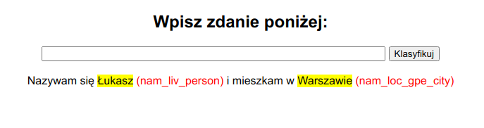

# Polish Named Entity Recognition

Named Entity Recognition using HerBERT (base)

## Repository tree

├── app
│   ├── static
│   │   └── css
│   │       └── main.css
│   ├── templates
│   │   ├── base.html
│   │   └── index.html
│   └── app.py
├── data
│   ├── preprocessed
│   │   ├── ner_vocab.json
│   │   ├── test_allegro-herbert-base-cased_25.pt
│   │   ├── test.txt
│   │   ├── train_allegro-herbert-base-cased_25.pt
│   │   ├── train.txt
│   │   ├── valid_allegro-herbert-base-cased_25.pt
│   │   └── valid.txt
│   ├── raw
│   │   ├── test.txt
│   │   ├── train.txt
│   │   └── valid.txt
│   └── preprocess.sh
├── polish_ner
│   ├── datasets
│   │   ├── dataloaders.py
│   │   ├── __init__.py
│   │   └── ner_dataset.py
│   ├── models
│   │   ├── base.py
│   │   ├── early_stopping.py
│   │   ├── __init__.py
│   │   └── ner_model.py
│   ├── networks
│   │   ├── auto_transformer.py
│   │   └── __init__.py
│   ├── __init__.py
│   └── predictor.py
├── tasks
│   ├── config.json
│   ├── predict_tags.sh
│   ├── start_app.sh
│   └── train_polish_ner.sh
├── training
│   └── run_experiment.py
├── weights
│   └── NerModel_NerDataset_allegro-herbert-base-cased_2021-04-12_18:55_weights.pt
├── demo.png
├── Dockerfile
├── .gitignore
├── LICENSE
├── README.md
└── requirements.txt

## Data

Datasets `kpwr_n82` from [this repository](https://github.com/mczuk/xlm-roberta-ner/).

## Setup
```zsh
python -m venv .venv
python -m pip install --upgrade pip
source .venv/bin/activate
pip install -r requirements.txt
```
## Training

* Load and preprocess data (also create NER vocabulary)
* Fine-tune HerBERT based on config.json
* Evaluate on test set
* Save weights into weights directory
* F1 score (micro) achieved `0.94356` on test dataset
``` zsh
chmod +x tasks/train_polish_ner.sh
tasks/train_polish_ner.sh \
    _PATH_TO_JSON_FILE_WITH_EXPERIMENT_CONFIG_
```

## Predict
* Load model and its weights
* Print input sentence with predicted NER (if any)
* To predict on GPU use --gpu flag
```zsh
chmod +x tasks/predict_tags.sh
tasks/predict_tags.sh \
    _PATH_TO_JSON_FILE_WITH_EXPERIMENT_CONFIG_ \
    _PATH_TO_FILE_WITH_MODEL_WEIGHTS_ \
    _TEXT_TO_PREDICT_NER_TAGS_(IN_DOUBLE_QUOTES)_
```


## App

One can also use Flask App to predict NER tags.
URL: `http://0.0.0.0:5000/`
```zsh
docker build -t polish-ner:latest .
docker run -it -p 5000:5000 polish-ner:latest
```

